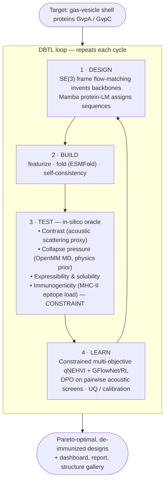

<div align="center">

# 🔊 SonoForge

### A closed-loop DBTL optimization backbone for de novo design of the molecular biosensors & actuators that couple neurons to ultrasound

**Author:** Dr. Sanjay Anbu

*Flagship target: gas-vesicle **acoustic reporter genes (ARGs)** — the genetically-encoded ultrasound contrast agents behind non-invasive, molecular brain–computer interfaces.*

[](https://github.com/sanjaydoc/sonoforge/actions/workflows/ci.yml)
[](https://www.python.org)
[](LICENSE)
[](https://github.com/astral-sh/ruff)

[**Whitepaper**](docs/WHITEPAPER.md) · [**Roadmap**](docs/PLAN.md) · [**Architecture**](#architecture) · [**Quickstart**](#quickstart)

</div>

---

## Why this exists

Non-invasive, high-bandwidth brain–computer interfaces are moving away from electrodes and toward **molecules** — genetically-encoded proteins that let neurons *talk to ultrasound*. Two protein classes make this possible:

- **Biosensors (READ):** gas vesicles — air-filled protein nanostructures ([acoustic reporter genes](https://www.science.org/doi/10.1126/science.aax4804)) that scatter ultrasound and make gene expression / neural activity visible through intact tissue.
- **Actuators (WRITE):** sonogenetic ion channels — mechanosensitive membrane proteins gated by focused ultrasound for cell-type-specific neuromodulation.

Engineering these molecules is a textbook **Design–Build–Test–Learn (DBTL)** problem over **sparse, noisy, expensive** wet-lab data. SonoForge is an open, reference implementation of the **closed-loop optimization backbone** such a program needs: it *designs* candidate proteins, *models their physics*, *scores* them against multi-objective goals under hard safety constraints, and *learns* the next, better library — round after round.

> **In one sentence:** an automatic protein designer that invents ultrasound-coupling biomolecules, simulates and scores them, and iteratively improves them under a tolerability constraint — a working miniature of a closed-loop molecular-discovery platform for molecular neurotech.

## What makes it different from a generic de novo pipeline

| | Generic de novo repo | **SonoForge** |
|---|---|---|
| **Target** | arbitrary binder | on-mission **acoustic reporter genes** (+ sonogenetic-channel extension) |
| **Sequence model** | one-hot / CNN | **Mamba/S4 protein language model** (state-space), transfer-learned on sparse ARG data |
| **Geometry** | Cα only | **SE(3)-equivariant frame flow-matching** (PyTorch **+ JAX** reference) |
| **Scoring** | learned proxy only | learned proxy **+ first-principles OpenMM molecular dynamics** (collapse-pressure & mechanical observables) |
| **Optimizer** | single-objective | **constrained multi-objective** qNEHVI + **GFlowNet/RL** proposal + **DPO** preference optimization |
| **Safety** | — | **immunogenicity / de-immunization as a hard constraint** (MHC-II epitope load) |
| **Uncertainty** | point estimates | ensembles + **calibration reporting** for expensive-oracle active learning |
| **Delivery** | notebook | typed API + **Gradio app** + MkDocs docs site (model democratization) |

Every row maps to a line item in Merge Labs' ML Research Scientist job descriptions (De Novo Design · Bayesian Optimization · Computational Biophysics). See the [whitepaper](docs/WHITEPAPER.md#appendix-a--role-coverage-matrix) for the explicit mapping.

## Architecture



## Quickstart

```bash
# 1. Environment
python -m venv .venv && source .venv/bin/activate
pip install -e ".[dev]"

# 2. Fetch the target + seed data (gas-vesicle proteins, ARG variants)
python scripts/download_data.py

# 3. Run one DBTL cycle (torch-free fallback works with no GPU/weights)
python scripts/run_cycle.py --n-cycles 5 --library-size 32

# 4. Explore results
streamlit run src/sonoforge/serve/dashboard.py
# or serve the model to non-experts:
python -m sonoforge.serve.api
```

The stack degrades gracefully: every heavy component (Mamba PLM, flow model, OpenMM, ESMFold) has a lightweight CPU fallback so the **loop and tests run end-to-end on a laptop** before any weights are downloaded.

## Project layout

```
sonoforge/
├── docs/                 # MkDocs-Material site (GitHub Pages) — WHITEPAPER, PLAN, model/dataset cards
├── src/sonoforge/
│   ├── data/             # GvpA/GvpC + ARG sequences, structures, featurization, Candidate schema
│   ├── plm/              # Mamba/S4 protein language model: sequence design + property heads
│   ├── generative/       # SE(3) frame flow-matching backbone generator (PyTorch + JAX ref)
│   ├── physics/          # OpenMM MD → collapse-pressure / mechanical observables (first-principles priors)
│   ├── oracle/           # contrast + collapse-pressure + expressibility + immunogenicity oracles
│   ├── optimize/         # constrained multi-objective qNEHVI · GFlowNet/RL · DPO · UQ
│   ├── loop/             # DBTL orchestration
│   ├── serve/            # typed API + Gradio app + Streamlit dashboard (democratization)
│   └── utils/            # config, logging, seeding
├── configs/              # Hydra configuration
├── scripts/ · tests/ · benchmarks/ · Dockerfile · .github/workflows/
```

## Status & roadmap

| Phase | Scope | Status |
|:--:|---|:--:|
| **0** | Scaffold, docs & scientific plan | ✅ |
| **1** | Data layer & `Candidate` schema (GvpA/GvpC, ARG panels) | ⬜ |
| **2** | Mamba/S4 protein language model (transfer learning) | ⬜ |
| **3** | SE(3) frame flow-matching generator (PyTorch + JAX) | ⬜ |
| **4** | Oracle stack — OpenMM physics + immunogenicity constraint | ⬜ |
| **5** | Closed loop — constrained qNEHVI + GFlowNet/RL + DPO + UQ | ⬜ |
| **6** | Serve, benchmark & report (API + Gradio + dashboard) | ⬜ |

Live sub-task tracker: [`PLANNING.md`](PLANNING.md) · Detailed roadmap + acceptance tests: [`docs/PLAN.md`](docs/PLAN.md) · Technical design: [`docs/WHITEPAPER.md`](docs/WHITEPAPER.md).

## Scientific honesty

This is a **methods and engineering** reference platform. Oracles are *in-silico proxies* (clearly labelled as such), not validated wet-lab assays — the point is a rigorous, reproducible **closed-loop backbone** into which real experimental data streams plug directly. Wherever a signal is simulated, the code and docs say so. See [`docs/WHITEPAPER.md#limitations`](docs/WHITEPAPER.md#limitations).

## License & data notes

- Code: **MIT** (see [`LICENSE`](LICENSE)).
- Protein structures: freely available from [RCSB PDB](https://www.rcsb.org).
- ESM-2 / ESMFold and any pretrained weights: released by their authors under their own terms — verify before commercial use.
- Gas-vesicle and acoustic-reporter biology draws on published work from the [Shapiro Lab](https://shapirolab.caltech.edu) and others; all references are cited in the whitepaper.
